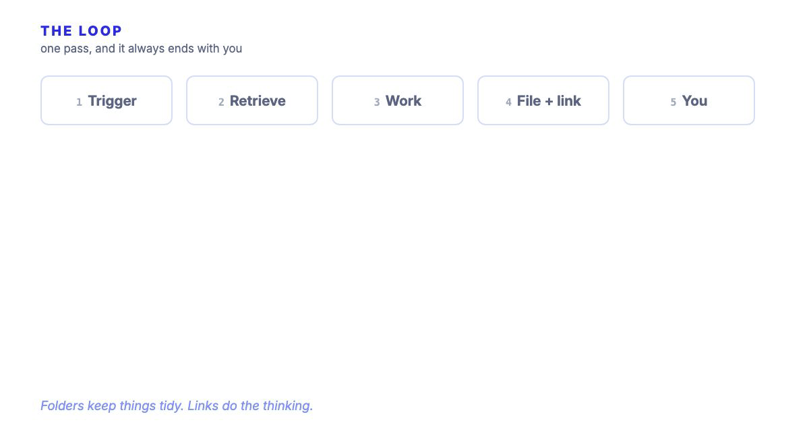
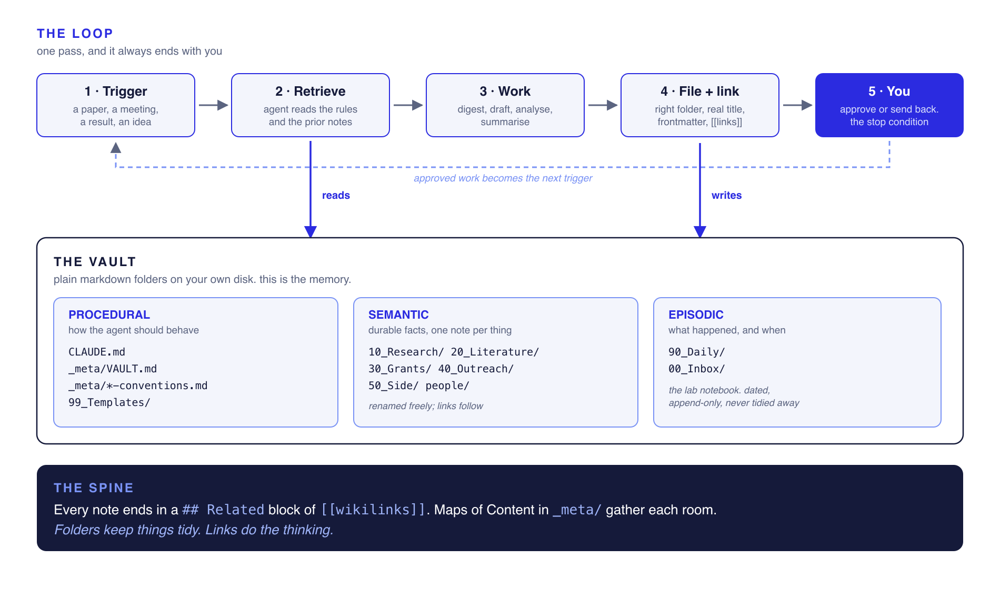

<p align="center">
  
</p>

<h1 align="center">Second Brain</h1>

<p align="center"><i>the model is the horse. this is the harness.</i></p>

<p align="center">
  A plain-markdown brain that an AI agent can actually <b>read, write to, and find its way</b> around.<br>
  For a PhD, a startup, or the project you start this weekend. No database, no plugins to buy,<br>
  no service to sign up to. Folders on your own disk.
</p>

<p align="center">
  Run daily across a PhD, a startup and every hackathon build &nbsp;·&nbsp; Obsidian + Claude Code
</p>

<p align="center">
  <a href="#quickstart"><b>◆ Build your own in 20 minutes&nbsp;→</b></a>
</p>

<p align="center">
  <a href="#">▶ Watch the walkthrough</a>
  &nbsp;&nbsp;·&nbsp;&nbsp;
  <a href="vault-template/">The template</a>
  &nbsp;&nbsp;·&nbsp;&nbsp;
  <a href="docs/">The guides</a>
  &nbsp;&nbsp;·&nbsp;&nbsp;
  <a href="CREDITS.md">Credits</a>
</p>

<p align="center">
  
</p>

---

## What is this, in plain terms?

A large language model knows almost everything about the world and **nothing about you**. It does not
know what you are working on, what you decided last Tuesday, or which of your files matters. Every
conversation starts from zero, and you spend the first ten minutes re-explaining your own life.

The usual fix is to paste more context in. That does not compound. You do it again tomorrow.

This is the other fix. You give the model a **place to remember**: a folder of markdown files,
organised so that an agent can work out where anything belongs without being told, and a small set
of written rules that say how to behave. That folder is the harness. The model is the horse.

I start one the day a project starts, whatever the project is. The important part is that **none of
it is clever**. There is no vector database, no embedding
pipeline, no RAG service. It is directories and text files, which means you can read it, grep it,
back it up, and still open it in ten years. The intelligence lives in the *conventions*, not the
infrastructure.

---

## The idea

An agent needs three kinds of memory to be useful over time. Sean Chen's talk on agent harnesses
(see [Credits](CREDITS.md)) names them cleanly, and the whole trick here is that **a filesystem can
be all three at once**:

| Memory | What it holds | Where it lives here |
|---|---|---|
| **Procedural** | how the agent should behave | `CLAUDE.md`, `_meta/VAULT.md`, `99_Templates/` |
| **Semantic** | durable facts, one note per thing | `10_Research/` … `50_Side/`, `people/` |
| **Episodic** | what happened, and when | `90_Daily/`, `00_Inbox/` |

Add a **loop that ends with a human** and you have a working harness. That is the entire system.

---

## Architecture

<p align="center"></p>

Read it top to bottom. A trigger arrives, the agent reads the rules and the prior notes, does the
work, files the result in the right place with the right links, and then **stops at you**. Approved
work becomes the next trigger. The vault underneath is the memory it reads from and writes back to.

---

## Quickstart

```bash
# 1. take the template
git clone https://github.com/faith-ogun/second-brain.git
cp -R second-brain/vault-template ~/MyBrain

# 2. open ~/MyBrain as a vault in Obsidian
#    https://obsidian.md  (free)

# 3. point an agent at it
cd ~/MyBrain
claude          # it reads CLAUDE.md on the way in and knows the filing rules
```

That is the whole install. Everything below is convention, and you can change all of it.

**First five minutes inside the vault:** open `_meta/VAULT.md`, put your own project in the one line
that asks for it, then open `_meta/MOC.md` and do the same. Those two files are what an agent reads
first, so they are the only ones that must be true on day one.

---

## The rooms

One instantiation, for research. Numbered so they sort themselves, with gaps on purpose so you can
add a room later without renumbering anything. For what these look like on a product build, see
[the vault is a pattern](#the-vault-is-a-pattern-not-a-folder-name).

| Folder | What goes in it |
|---|---|
| `00_Inbox/` | dump here when you are in a hurry. cleared weekly, never permanent |
| `10_Research/` | the project itself: aims, methods, results, decisions |
| `20_Literature/` | one note per paper, plus concept notes |
| `30_Grants/` | applications, deadlines, reports, funder admin |
| `40_Outreach/` | talks, supervisor updates, conferences, peer review |
| `50_Side/` | everything that is not the main project but still yours |
| `90_Daily/` | one note per day. the lab notebook. append-only |
| `99_Templates/` | the shape of each note type |
| `_meta/` | how the vault works, and the Maps of Content |
| `people/` | one note per human. linked from everywhere |

Rename them to suit your work. A lawyer's rooms are not a biologist's. The *numbering habit* is the
transferable part, not my folder names.

---

## How the agent knows where things go

This is the question everybody asks, and the answer is boring: **you write it down once**, in
`CLAUDE.md` at the vault root. Agents read that file automatically on the way in.

Every note gets the same four things, and once those are consistent an agent can file anything:

```markdown
---
title: "Human readable title"        # a real title, never a date or a code
type: paper                          # paper | result | method | meeting | person | grant | concept
status: current                      # current | active | done | archived
tags: [type/paper, topic/chromatin]  # facets, not hierarchy
last-reviewed: 2026-08-25
---

# Human readable title

...the actual note...

## Related
- [[Another note]] · [[A person]] · [[_meta/MOC]]
```

The **`## Related` block at the bottom is the load-bearing part**. It is the one thing I would keep
if I had to throw the rest away. Folders decide where a note sits; links decide what it *means*. A
paper linked to the result it supports and the grant claim it threatens is worth more than the same
paper filed perfectly and connected to nothing.

Full rules: [`docs/04-filing-rules.md`](docs/04-filing-rules.md).

---

## The one loop to instrument first

Do not automate five things. Automate one, all the way through, and leave it alone for a month.

Mine is the **paper-a-day loop**:

1. a paper arrives, from me or from a feed
2. the agent digests it into a literature note
3. the day's daily note records that I read it
4. **the agent links it** to the project layer it touches and any grant claim it supports or threatens
5. I read it and approve, or send it back

Step 4 is the only step that compounds. Steps 1 to 3 save you time once. Step 4 makes the vault
worth more every single day.

Step 5 is not optional. **Never delegate the approval node.** You are the stop condition, and an
agent with no stop condition is not a harness, it is a runaway horse.

---

## The weekly review

Fifteen minutes on a Friday. There is one user, so there is no dashboard.

Three questions: *did it help me learn, did it survive contact with a real reader, what annoyed me?*
Then clear `00_Inbox` to zero, open the graph view and either link or bin the orphans, and pull any
real decisions out of the daily notes into permanent ones.

If you skip this, the vault silently becomes a junk drawer, and no amount of tooling saves it.

---

## The vault is a pattern, not a folder name

The rooms in the template are one instantiation. The pattern is what transfers, and it renames
cleanly for whatever you are doing.

I start a vault the day a project starts, before there is any code, because the decisions worth
keeping are made in the first hour and they are the ones nobody writes down. On a research project
the rooms look like the template. On a product build they look nothing like it, and it is still the
same three memories underneath:

| | Research vault | Product or startup build |
|---|---|---|
| **Procedural** | `CLAUDE.md` · `_meta/` · `99_Templates/` | `CLAUDE.md` · `AGENTS.md` · `_templates/` |
| **Semantic** | `10_Research/` `20_Literature/` `people/` | `decisions/` `architecture/` `brand/` `competitors/` `customers/` `compliance/` |
| **Episodic** | `90_Daily/` | `logs/` one file per iteration |

The folder holding it all does not even have to be called anything sensible. In my own projects it
has ended up as `metadata/`, `docs/` and once, unhelpfully, `assets/`. It works anyway, because the
agent is told where to look in one line of `CLAUDE.md`, and nothing else depends on the name.

**The one convention I would steal from the product side:** name episodic files
`YYYY-MM-DD-iter-NNN-what-changed.md`. Dated so they sort, numbered so you can refer to one out
loud, and named so you can find the right one without opening any of them. Six months later that
folder is the only honest account of why the thing is built the way it is.

---

## What it is good for

Real jobs this has done, so you can judge whether it would earn its keep:

- **Starting anything new.** Day one, before the first file of code. The agent has somewhere to put
  decisions from the first hour instead of losing them in a chat window you will close.
- **Shipping under a deadline.** Dated iteration logs mean that when you come back after two days
  away mid-build, you get the state of play in one file rather than reconstructing it from git.
- **Remembering why.** Six weeks later, "why did we choose this" has a written answer instead of
  three people guessing. This is the one that quietly saves the most time.
- **Handover.** Someone else, or a fresh agent session, can pick the project up from the vault
  rather than from your memory. This is also what makes a new chat useful in ten seconds instead of
  ten minutes.
- **Writing the thing at the end.** Grant sections, reports, submissions, launch posts. Every claim
  traces back to the note behind it, because the link is already there.
- **Meetings and updates.** The agent reads the record and drafts the update. You correct it.
- **Coming back after time away.** Two weeks off, and the honest answer to "where was I" is written
  down rather than half remembered.
- **Not losing things.** The least impressive to demo, and the biggest win by a distance.

I run this for the PhD, for a startup, and for every hackathon project I start. The PhD vault is the
oldest. It is not the largest.

---

## Honest limits

- **It is a filing system, not magic.** If your notes are thin, the agent's output is thin. Rubbish in, rubbish out, faster.
- **The first fortnight feels like overhead**, because you are paying for structure you have not yet used. It pays back after that, not before.
- **It will not make you a better scientist.** Your moat is the work, not the workflow. If you catch yourself perfecting the vault instead of doing the thing the vault is for, close it.
- **Nothing here is novel infrastructure.** Markdown, folders and wikilinks all predate me by years. What is mine is the specific set of conventions, tested daily on real work for long enough to know which ones survive contact.

---

## Credits

The memory and harness framing comes from **Sean Chen**, an ex-Google engineer whose talks on agent
harnesses, loop engineering and evals are the clearest explanation of this I have found. Full
attribution and links in [CREDITS.md](CREDITS.md). The instantiation, the conventions, the filing
rules and everything that survived a year of daily use are mine.

Built by [Faith Ogundimu](https://faith-ogun.github.io). PhD candidate in cancer genomics at RCSI.

---

<p align="center"><i>The brain is worth building precisely because it should disappear into the<br>background and let the work be the hard, visible thing.</i></p>
